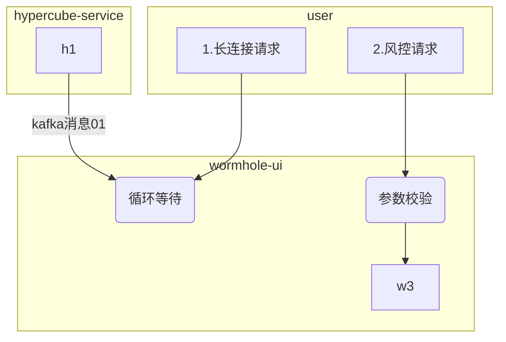
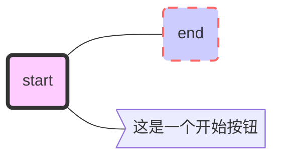
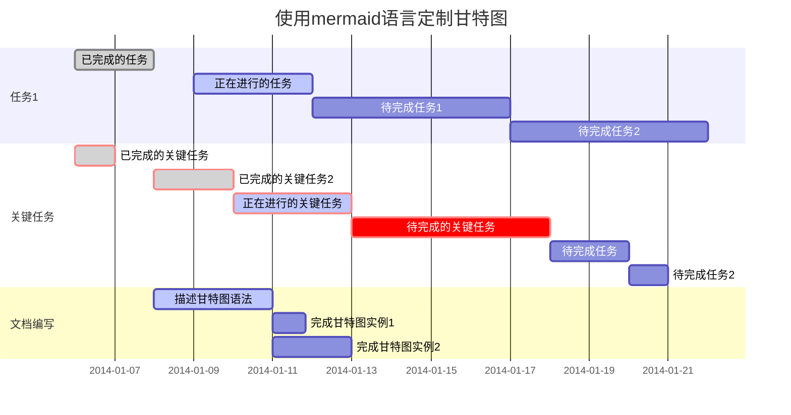
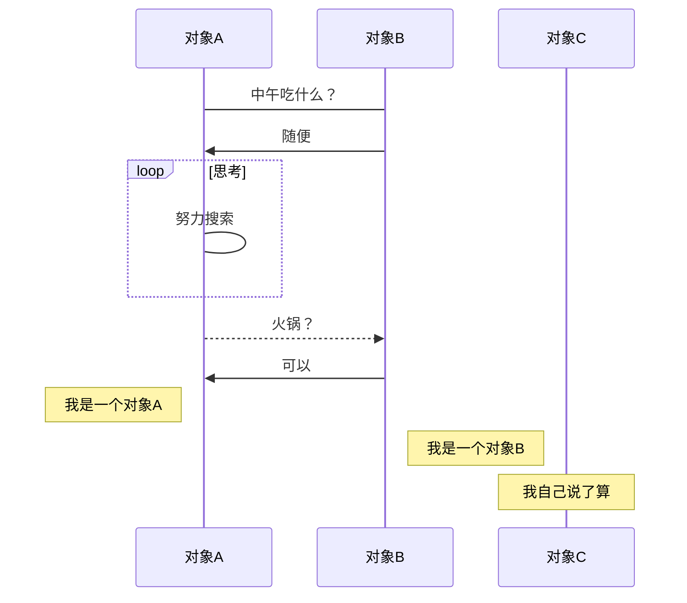

```mermaid
graph LR
    ID{不规则图形}-->id2[方形]
    id2 --描述--> id3[123]
	id3 -->id4
	id4 --> id5
	id5== asdaasdmiao==>id6
	id7((请求))-.继承.->id8((结束))
	
    
```





```flow
flowchat
st=>start: start
e=>end: end
op=>operation: what you want
cond=>condition: Sure？

st->op->cond
cond(yes)->e
cond(no)->op
```

```sequence
participant user
participant wormhle_ui
participant hyper_service

user-->wormhle_ui:长连接请求
wormhle_ui->wormhle_ui:长连接等待
user->user:若长连接超时，自动断开

user-->wormhle_ui:风控检查请求

wormhle_ui->wormhle_ui:风控请求

wormhle_ui->hyper_service:dubbo

hyper_service->hyper_service:分多个线程执行风控检查

hyper_service->wormhle_ui:检查结果发送到kafka

wormhle_ui--user:返回风控结果
user->user:关闭长连接


```






$$
f(x)=
$$

<kbd>ctrl</kbd>+<kbd>shift</kbd>+<kbd>del</kbd>

这是一个==强调==句子

H<sub>2</sub>O  H~2~O

x^2^   x<sup>2</sup>


写一个角标[^1]

[^1]:这是一个角标

 ~~删除线~~
$$
a_i+\acute{a} \grave{a} \hat{a} \tilde{a} \breve{a} + x^2_3+\overbrace{ 1+2+\cdots+100 }^{5050}+ \sqrt{x^2 + y^2} +\int_{-N}^{N} e^x\, dx + \int^{-N}_{N} e^x\, dx
$$

> 备份几个收集来的比较全的Tex语法
>
> https://math.meta.stackexchange.com/questions/5020/mathjax-basic-tutorial-and-quick-reference
>
> http://www.mohu.org/info/symbols/symbols.htm
>
> https://kogler.wordpress.com/2008/03/21/latex-use-of-math-symbols-formulas-and-equations/#opennewwindow
> ————————————————
> 版权声明：本文为CSDN博主「爆炒小青蛙」的原创文章，遵循 CC 4.0 BY-SA 版权协议，转载请附上原文出处链接及本声明。
> 原文链接：https://blog.csdn.net/ismedal/article/details/80032585


<details>   
      <summary>
          <mark><font color=darkred>点击查看详细内容</font></mark>
      </summary>  
      <p> - 测试 测试测试</p>  
      <pre>
          <code>   for i in a:     print(i)   </code>
      </pre> 
</details>  


<details>   
      <summary>
          <font>查看详细内容</font>
      </summary>  
      <p> - 测试 测试测试</p>  
      <pre>
          <code>   
          for i in a:    
            print(i)   
            </code>
      </pre> 
</details>  


